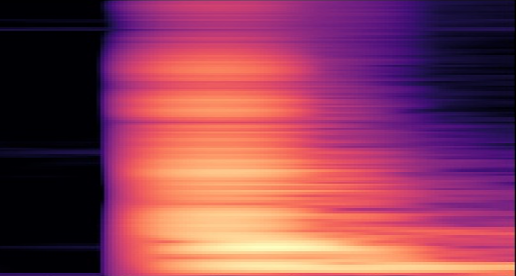

# Acoustic Sound Localization and Classification

## Introduction

The following repsitory contains a neural network model for localization of acoustic events on a car and classifying the class of event. 
The model architecture is based on the following [paper](./paper/Hu_paper.pdf) for the [2020 Detection and Classification of Acoustic Scenes and Events-Challenge](http://dcase.community/challenge2020/task-acoustic-scene-classification-results-a) written by Hu et al. However only parts of the proposed solution were taken here.

## Experimental results 
Tested on a dataset which was collected on a SUV equipped with 20 IEPE accelerator sensors. 

| Part       |   Dev Acc. | 
| :---         |      :----:   | 
|  0 - Door f.l.  | 94%    | 
|  1 - Door r.l. | 95%    | 
|  2 - Door f.r.  | 62%    | 
|  3 - Door r.r |  96%   | 
|  4 - Lower l. |  25%   | 
|  5 - Lower r. |  0%   | 
|  6 - Mudguard l. |  100%   | 
|  7 - Mudguard r. |  89%   | 
|  8 - Rear l. |  86%   | 
|  9 - Rear r. |  92%   | 
|  10 - Rear |  75%   | 
|  11 - Front |  100%   | 
|  12 - Hood |  89%   | 
|  13 - Windscreen |  83%   | 
|  14 - Rearwindow |  100%   | 
|  15 - Roof |  100%   | 
|  Total |  89%   | 


## Prerequisites
* Linux or macOS
* Python3
* CPU or NVIDIA GPU + CUDA CuDNN
* pip installation of all required python packages listed in [requirenments.txt](./requirements.txt).
> pip install -r requirements.txt

## How to use
### Download raw data
* Download raw data from webtool as a zip file and dezip the data (DISCLOSED). 
* Save dezipped json files in [raw](./data/raw) folder.
* Data has the following format:
```json
{"_id": "87bf47e8-bbeb", 
 "id": "87bf47e8-bbeb",
 "classification": {"id": "7b1cc5b5-20e5",
                    "name": "bump",
                    "description": "no_description"},
 "firstDetector": "audisensornode1",
 "surfaceLocation": {"equatorial": 58, "height": 5},
 "time": 1614852318390,
 "sensor_data":{"0":[[1614852312304, [32709, 32725, 32809, 32703]], [1614852312304, [32709, 32724,  32807, 32704]]], 
                "1":[[...]], 
                "2":[[...]], 
                "3":[[...]], 
                "4":[[...]]}} 
```
### Set configurations
Set desired data configurations in the [json config files](./config).
The `source_dir_local` parameter should be the directory to the folder the raw data is saved.

### Preprocess and augment raw data
By executing 
> python preprocess_data.py   

the following processing steps are computed:
* Verify data (check for missing channels etc.)
* Process data (cut to same minimal length) 
    * processed data is saved in the same json format in [processed](./data/processed). The naming is `timestamp_(x_coord, y_coord)_class.json`
    * Example of raw data (one channel)

        
* Extract features (calculate logmel-spectrogram)
    * the logmel spectrograms are saved in [features](./data/features) as npy file with same naming as the corresponding json-file.
    * The dimensions depend on the configurations. With default configuration the logmel is a 2D array with the following dimension for one channel: `(128, 169)`. 
    * Example of logmel spectrogram:
    
        
* Augment data (augment via pitch-shift, time-shift and adding of random noise)
    * Note that random cropping, frequency masking and time masking do not generate extra data thus are executed on the fly during training.
* Split into test and train-data    
 

### Train model
To train the model please set the desired configs and run    
> python train.py  

### Evaluate model

## Pre-trained models
Pre-trained models are provided in [localization model](./model_checkpoints/location/model_localization.zip) and [classification model](./model_checkpoints/location/model_localization.zip)

## File structure:
### [config](./config): 
* [DataConfig.json](./config/DataConfig.json) contains all data related parameters to set 
    * `int num_audio_channels = 20 ` - Number of channels 
    * `float duration = 0.125` - Duration of signal to consider
    * `int sampling_rate = 48000` - Sampling rate of sensor
    * `int num_freq_bin = 128` - Number of frequency bins for calculating the logmel spectrogram
    * `int hop_length = 32` - hop length (stride of STFT window) for logmel calculation
    * `ìnt num_fft = 2048`- number of fft for STFT
    * `bool normalize = false` - normalize signal or not
    * `float mixup_alpha = 0.4` - alpha parameter for mixup used for augmentation
    * `float crop_percentage = 0.1` - percentage of signal to cut out 
    * `str source_dir_training = "data/features"` - directory to training data
    * `str source_dir_local = "data/raw"` - directory to raw data
    * `str source_dir_augmented = "data/augmented"`- directory to augmented data
    * `str source_dir_further_data` - optional directory to additional data for training
    * `str valid_extension = "npy"` - valid extension for loading training and test data
    * `list red_channels = [2,5,9,14,15,19]` - indexes of channels which should be kept for trainng on reduced channels
    * `list augmented_data_folders = ["time_shift", "pitch_shift", "add_random_noise"]` - list of data folders containing augmented data
* [ModelConfig.json](./config/ModelConfig.json) contains all model related parameters to set 
    * `bool count_num_classes = true` - decides wether to automatically count number of classes of training data before training or use user specific number
    * `int num_classes_location = 507` - number of classes for localization
    * `int num_classes_class = 4` - number of classes for classification
    * `list num_filters = [12, 24, 48]` - number of convolutional layers specified in [network.py](./models/network.py)
    * `int wd = 0` - factor for kernel regularizor
* [TrainConfig.json](./config/TrainConfig.json) contains all training related parameters to set 
    * `int batch_size = 128` - for training on 4 GPUs, for cpu or single GPU 32
    * `int num_epochs = 254` - number of epochs to train
    * `float max_lr = 0.1` - maxium learning rate
    * `float end_lr = 0.00001` - minimum learning rate at end of training
    * `int decay_steps = 100` - decay steps for learning rate decay
    * `float decay = 0.000001` - decay factor for linear learning rate
    * `float train_percentage = 0.9` - percentage of training data
    * `float test_percentage = 0.1` - percentage of test data
    * `int num_workers = 16` - number of worker to use 
    * `str visible_gpus = "0,1,2,3` - IDs of visible gpus to train on
    * `bool train_on_gpu = false` - Decide wether to train on gpu
    * `str checkpoint_folder = "model_checkpoint"` - directory for saving checkpoints during training
    * `str loss = "categorical_crossentropy"` - loss function
    * `str metrics = "val_accuracy"`- metric for evaluation of model
    * `bool do_mixup = false` - decide wether to use mixup for augmentation (to be implemented)
    * `list epochs_restart = [3.0, 7.0, 15.0, 31.0, 63.0, 127.0]` - number of epochs for lr restart with lr_warm_restart
    * `float momentum = 0.9` - momentum for SGD optimizer
    * `str labeltype = location` - location or class determine wether to train localization or classification
    * `str ref_label_path_location = "data/reference_labels/labels_localization.json"` - path to reference label file for localization
    * `str ref_label_path_class = "data/reference_labels/labels_class.json"` - path to reference label file for classification
    * `str resume_model` - optional: model to resume from
    * `str lr_scheduling_method = "linear_decay"` - linear_decay or lr_warm_restart 
    * `bool do_data_preprocessing = true` - decides wether to do preprocessing
    * `bool extract_ref_labels = true` - decides wethet to extract reference labels and save as new file

* [TestConfig.json](./config/TestConfig.json) contains all test related parameters to set 
    * `str path_test_data = "data/test"` - path to test data 
    * `str path_model = "model_checkpoints/localization"` - path to model checkpoint for localization
    * `str path_model_class = "model_checkpoints/class"` - path to model checkpoint for classification
    * `bool use_training_data = false` - decides wether to include training data in evaluation
    * `str savepath_dataframe = "evaluation"` - path to save dataframe from evaluation
    * `float confidence_threshold = 0.02` - confidence threshold for predictions to consider for evaluation (prediction with confidence < threshold are not considered)

### [data](./data):
* [augmented](./data/augmented) contains pre augmented data 
    * [add_random_noise](./data/augmented/add_random_noise)
    * [pitch_shift](./data/augmented/pitch_shift)
    * [time_shift](./data/augmented/time_shift)
* [features](./data/features) logmel-spectrograms saved as .npy file 
* [processed](./data/processed) verified and processed data (.json-files). Analogous to training data set.
* [raw](./data/raw) data downloaded from the web application and dezipped
* [reference_labels](./data/reference_labels) contains reference json files with all the labels of the training data set
* [test](./data/test) dataset which is not seen during training (and should not be augmented!)

### [evaluation](./evaluation)
For evaluating a model do the following steps:
* set the `path_model` parameter to the directory of the model to be tested in the [TestConfig](./config/TestConfig.json) and all additional configurations.
* run the following script:
> test.py
* the script will generate a csv-file with prediction details, such as the following format (header):

    `[groundtruth, prediction, confidence, distance]`

* For evaluation run the evaluation script. 
> evaluation.py
* It will generate a json file with accuracies for every part of the car as well as total accuracy of the following format:

    ```json
    {"partname1": accuracy,
     "partname2": accuracy,
     ...,
     "total": accuracy
    }
    ```

### [model_checkpoints](./model_checkpoints)
* [class](./model_checkpoints/class) contains saved checkpoints during training classification model
* [location](./model_checkpoints/location) contains saved checkpoints during training localization model

### [models](./models) 
* [network.py](./models/network.py) contains model architecture and function to create model class.

### [utils](./utils)
* [augmentation.py](./utils/augmentation.py) 
* [dataio.py](./utils/dataio.py) 
* [process_labels.py](./utils/process_labels.py) 
* [training_funcs.py](./utils/training_funcs.py) 
* [utils.py](./utils/utils.py) 
* [verification_data.py](./utils/verification_data.py) 


### Additional ideas
To further improve the algorithm the following ideas are suggested:
* Use a chain of sequential models to improve model accuracy such as in the paper. The first model only detects the region of the event while the second is more detailled for example.
* Analyse different parameters to generate the logmel spectrogram
* Use mixup for data augmentation

